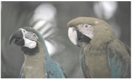

# Purpose : how see a dog

## Example

What a human see


What a dog could see


## Installation

Get the release at : [https://github.com/fuckingdarkknight/looping/releases/download/1.0.0/looping]

### Open a console

```shell
curl -LO https://github.com/fuckingdarkknight/looping/releases/download/1.0.0/looping
chmod u+x looping

./looping

Missing required parameter: '<filename>'
Usage: looping [-hvV] [-l=<transformation>] <filename>
      <filename>   Filename to convert
  -h, --help       Show this help message and exit.
  -l, --linear=<transformation>

  -v, --verbose
  -V, --version    Print version information and exit.
```

### Only jpeg and png format are supported

Usage example:

```shell
./looping pere-noel-1.jpg
```

What a human see


What a dog could see


# framework

This project uses Quarkus, the Supersonic Subatomic Java Framework.

If you want to learn more about Quarkus, please visit its website: [https://quarkus.io/].

## Running the application in dev mode

You can run your application in dev mode that enables live coding using:

```shell script
./mvnw compile quarkus:dev
```

> **_NOTE:_**  Quarkus now ships with a Dev UI, which is available in dev mode only at [http://localhost:8080/q/dev/].

## Packaging and running the application

The application can be packaged using:

```shell script
./mvnw package
```

It produces the `quarkus-run.jar` file in the `target/quarkus-app/` directory.
Be aware that it’s not an _über-jar_ as the dependencies are copied into the `target/quarkus-app/lib/` directory.

The application is now runnable using `java -jar target/quarkus-app/quarkus-run.jar`.

If you want to build an _über-jar_, execute the following command:

```shell script
./mvnw package -Dquarkus.package.type=uber-jar
```

The application, packaged as an _über-jar_, is now runnable using `java -jar target/*-runner.jar`.

## Creating a native executable

You can create a native executable using:

```shell script
./mvnw package -Dnative
```

Or, if you don't have GraalVM installed, you can run the native executable build in a container using:

```shell script
./mvnw package -Dnative -Dquarkus.native.container-build=true
```

You can then execute your native executable with: `./target/looping-1.0.0-SNAPSHOT-runner`

If you want to learn more about building native executables, please consult [https://quarkus.io/guides/maven-tooling].

## Related Guides

- Picocli ([guide](https://quarkus.io/guides/picocli)): Develop command line applications with Picocli

## Provided Code

### Picocli Example

Hello and goodbye are civilization fundamentals. Let's not forget it with this example picocli application by changing the `command` and `parameters`.

[Related guide section...](https://quarkus.io/guides/picocli#command-line-application-with-multiple-commands)

Also for picocli applications the dev mode is supported. When running dev mode, the picocli application is executed and on press of the Enter key, is restarted.

As picocli applications will often require arguments to be passed on the commandline, this is also possible in dev mode via:

```shell script
./mvnw compile quarkus:dev -Dquarkus.args='Quarky'
```
